# froot

*Durable maintenance loops, pointed at any repo.*

> ⚠️ **Experimental, WIP, and written agentically.** froot is an early
> work-in-progress, built largely by AI agents, and specific to the author's
> own projects and infrastructure today. It is **not** general-purpose or
> production-ready for others. Generalizing to other repos — and possibly a
> hosted solution — is intended future work, not a current claim.

> This is the charter — the **what** and the **why**. Technical design (Temporal topology,
> loop config, infra) follows in a later revision. When in doubt, this document is the
> tiebreaker: it says what froot is *for*, so the how can be argued on the merits.

---

## What froot is

froot is a Temporal worker that runs autonomous code-maintenance loops and points them at
target repositories. A loop watches a repo for one class of decay, proposes a bounded fix
as a pull request, lets the repo's **own CI** verify it, and leaves the outcome behind as a
signal others can read. A human approves the merge.

The first loop keeps dependencies patched. froot is not that loop — it is the **chassis** the
loop runs on: one durable substrate, many specialized loops, any number of repos.

## Why froot exists

We already have a suite of maintenance agents across several existing repos.
They are useful and they are **open loops** — they fire from a local command,
do their work, print a result, and forget. Held against the Many Hands Engineering definition
of a loop — *signal → action → verification → commit/revert → **update*** ([MHE §3.2][mhe]) —
they are missing the last ingredient and the authority to act on it. And those two missing
pieces — a **signal-update** (a decaying trace left in the terrain) and an **authority surface**
(rules for when autonomy expands or contracts) — are *exactly* the two that require state to
survive across runs.

That is the whole reason froot is built on Temporal. Durability is not a reliability upgrade;
it is what **closes the loop**. A durable schedule is the self-trigger. Durable state is the
persisted outcome and the track record. A durable wait is how a loop sits on CI for an hour
without holding anything open.

> **froot exists to close loops** — and to do it first on the most boring, most reversible loop,
> so that loop becomes the **template** every later loop is cheaper for. The platform grows by
> adding loops, not by making any one loop smarter ([MHE §3.11][mhe]).

## Principles

These govern every froot decision. When a design choice is unclear, it is wrong if it
violates one of these.

1. **Loops must close.** Every loop has all six ingredients — signal, bounded action,
   verification, reversibility, signal-update, authority surface. A run that leaves no durable
   trace and no authority rule behind is a script, not a loop.
   *Why: closing is the difference between work that compounds and work that becomes noise.*

2. **Spine-heavy, model-thin.** Deterministic code owns *when* and *whether*; the model owns
   only *what needs judgment*. dependency-patch is ~90% mechanical, so the model's entire job
   is "is this changelog truly a clean patch."
   *Why: determinism is replay-safe, cheap, and auditable; model autonomy is none of those —
   spend it only where judgment is irreducible.*

3. **CI is the oracle.** froot never re-runs a repo's tests. It opens a PR and lets the repo's
   own CI verify, durably waiting on the result.
   *Why: the verification terrain already exists and is already trusted for human PRs. Building
   a second one is waste, and a second one will drift from the first.*

4. **Derive, never store.** Outcomes live in GitHub (merged / closed / reverted / time-to-merge).
   Run telemetry lives in ClickStack (cost, candidates dropped, CI-wait). froot keeps no
   database of its own.
   *Why: this is froot obeying the same derived-state invariant its loops enforce
   ([MHE §2.3][mhe]). Two independent external truths also give triangulation against gaming
   for free ([MHE §3.8][mhe]).*

5. **The chassis generalizes; the loop specializes.** The durable machinery is identical for
   every loop and every repo. Only the signal, the lockfile command, and the prompt change.
   *Why: this is how one substrate fields an army of specialists without forking — and it is
   the exact line between "build once" and "tune per target."*

6. **Earn autonomy; record first, gate later.** Every PR starts human-approved. froot records
   the track record and now acts on it where a class has earned the grant on an allowlisted repo
   (the acting gate); the allowlist is empty by default, so elsewhere it stays advisory. Trust,
   when granted, is earned, narrow, conditional, revocable, and expiring ([MHE §3.7][mhe]).
   *Why: you cannot move a gate honestly without a track record, and you cannot earn one without
   first running supervised.*

7. **Grow by adding loops, not by broadening one.** froot stays at one loop until it closes
   end-to-end. The next capability is the next loop, reusing the chassis.
   *Why: a dozen simple loops compounding beats one clever loop burning attention.*

## The first loop: dependency-patch

The canonical starter ([MHE §3.1][mhe]): small, reversible, present in every codebase, and
the loop humans most dislike doing by hand.

**The flow** — a loop that closes. Nodes are colored by who owns each step:
🔵 chassis (deterministic, durable) · 🟣 model (thin pydantic-ai) · 🟢 terrain (external) · 🟠 steward (human).

```mermaid
%%{init: {'theme': 'base', 'themeVariables': {'edgeLabelBackground':'#ffffff', 'lineColor':'#9e9e9e', 'tertiaryTextColor':'#424242', 'primaryTextColor':'#424242'}}}%%
flowchart LR
    %% froot — the dependency-patch loop, closing through derived external truth
    %% stages map to MHE §3.2: signal → action → verification → commit/revert → update

    Schedule["⏰ Durable schedule<br/>(Temporal timer)"]
    Checkout["📥 Shallow checkout<br/>(target repo)"]
    Scan["🔍 Find patch candidates<br/>(npm outdated · deterministic)"]
    Judge["🤖 Judge changelog risk<br/>(thin pydantic-ai)"]
    PR["🔀 One PR per bump<br/>(manifest + lockfile · idempotent)"]
    CI{"✅ Repo's own CI<br/>green?"}
    Merge["👤 Human merges<br/>(approval gate)"]
    Closed["↩️ Close PR<br/>(mark signal)"]
    Record["📊 Record outcome"]
    GitHub[("🐙 GitHub<br/>outcome ledger")]
    Click[("📈 ClickStack<br/>run telemetry")]

    %% ① signal
    Schedule -->|"&nbsp;① signal&nbsp;"| Checkout
    Checkout --> Scan
    %% ② action
    Scan --> Judge
    Judge -->|"&nbsp;② action&nbsp;"| PR
    %% ③ verification — the durable wait on the oracle
    PR -->|"&nbsp;③ durably wait on CI (mins–hrs)&nbsp;"| CI
    %% ④ commit / revert
    CI -->|"&nbsp;green&nbsp;"| Merge
    CI -->|"&nbsp;red&nbsp;"| Closed
    Merge -->|"&nbsp;④ commit&nbsp;"| Record
    Closed -->|"&nbsp;revert&nbsp;"| Record
    %% ⑤ update — derived, never stored
    Record -->|"&nbsp;⑤ update&nbsp;"| GitHub
    Record --> Click
    %% the loop closes
    Record -.->|"&nbsp;decays into the next run's signal&nbsp;"| Schedule

    %% link colors blend between the categories they connect
    linkStyle 0 stroke:#0288d1,stroke-width:2px
    linkStyle 1 stroke:#0288d1,stroke-width:2px
    linkStyle 2 stroke:#4f5bc4,stroke-width:2px
    linkStyle 3 stroke:#4f5bc4,stroke-width:2px
    linkStyle 4 stroke:#2f8f8a,stroke-width:2px
    linkStyle 5 stroke:#7e8a2e,stroke-width:2px
    linkStyle 6 stroke:#2f8f8a,stroke-width:2px
    linkStyle 7 stroke:#7a6a90,stroke-width:2px
    linkStyle 8 stroke:#0288d1,stroke-width:2px
    linkStyle 9 stroke:#2f8f8a,stroke-width:2px
    linkStyle 10 stroke:#2f8f8a,stroke-width:2px
    linkStyle 11 stroke:#9e9e9e,stroke-width:2px,stroke-dasharray:5

    classDef chassis fill:#e1f5ff,stroke:#0288d1,stroke-width:2px,color:#01579b
    classDef model fill:#ede7f6,stroke:#5e35b1,stroke-width:2px,color:#311b92
    classDef terrain fill:#e8f5e9,stroke:#388e3c,stroke-width:2px,color:#1b5e20
    classDef steward fill:#fff3e0,stroke:#f57c00,stroke-width:2px,color:#e65100

    class Schedule,Checkout,Scan,PR,Record,Closed chassis
    class Judge model
    class CI,GitHub,Click terrain
    class Merge steward
```

**It now closes.** The four ingredients it already had carry over; the two it lacked are what
froot supplies:

| Ingredient | Before (local script) | In froot |
|---|---|---|
| Signal | `npm outdated`, ephemeral | same, fired by a durable schedule |
| Bounded action | bump in the working tree | manifest + lockfile edit → one PR per bump |
| Verification | local suite re-run | **the repo's own CI**, durably awaited |
| Reversibility | `git restore` | revert the merged PR |
| **Signal-update** | printed, then discarded | the PR + its GitHub/CI outcome + ClickStack telemetry |
| **Authority surface** | "in the operator's head" | human-approves-every-PR; write authority, not commit authority |

**The lockfile.** A patch bump that only edits `package.json` is inconsistent — CI's `npm ci`
fails on a manifest/lockfile mismatch, so CI cannot be the oracle. froot regenerates the
lockfile too, in **lockfile-only, no-scripts mode** (`npm install <pkg>@<v> --package-lock-only
--ignore-scripts`; `uv lock --upgrade-package <pkg>` for Python), and commits both files to the
branch. CI then runs `npm ci` / `uv sync --frozen` against a consistent pair.

*Why this way:* regenerating a lockfile is far lighter than installing and testing, so the
worker stays small — it carries package managers, not test toolchains. And `--ignore-scripts`
means **no third-party dependency code ever executes inside the privileged, token-bearing
worker**; the real install, scripts, build, and tests happen in CI, which is already a sandbox.
Tiny blast radius, by construction. (This is the proven Renovate/Dependabot mechanic — we own
it, rather than depend on it, because the loop is the template, not the bumps.)

## Chassis vs loop: the seam

**The chassis (build once, in froot):** the durable schedule; checkout; the durable wait on CI;
PR plumbing and idempotent branch naming; GitHub auth; telemetry; the structured outcome record.
Modeled on an existing durable Temporal app's chassis — *its shape, not its domain.*

**The loop (a small config the chassis consumes):** the **signal** (`npm outdated`, `npm audit`,
an AST scan, a regex sweep — genuinely heterogeneous, never forced behind one interface); the
**lockfile command** (the one per-ecosystem seam); the **prompt** (what judgment the model makes).

Rule of thumb: the chassis is the same for every loop and every repo; signal + lockfile-command
+ prompt are what make a loop a *specialist*.

Where this seam is headed — an open loop *registry* the spine consumes (rather than an enum it
branches on), loops feeding each other through the shared outcome ledger, and a pluggable
mechanical-or-agentic executor behind the action — is the north star in [VISION.md](./VISION.md).

## Reputation: derived, never stored

froot builds **no reputation store**. Reputation is a read-model computed when it's needed, from
two sources it already has:

- **GitHub** — the outcome ledger. A consistent `loop/<name>/...` branch and label convention
  makes every PR queryable: merged, closed, reverted, time-to-merge, CI pass/fail.
- **ClickStack** — the run ledger. Cost, candidates considered-but-dropped, CI-wait, escalations,
  emitted as OTEL (the observability path already in place).

froot began **record-only** and earned its way off it: the gate now auto-merges on an allowlisted
repo where a class has cleared its bearings (the allowlist is empty by default, so elsewhere it
stays human-approves-every-PR). Having the track record first is what let moving the gate be what
the numbers say rather than a guess ([MHE §3.6][mhe]) — and trust is granted with all five of its
properties intact.

## Roadmap

Staged, deliberately ([MHE §3.4][mhe]). Each stage earns the next.

1. **✓ Close one loop.** dependency-patch, end-to-end, on one target repo. The template. *Done.*
2. **✓ Replicate.** security-patch — the same chassis, a sharper signal, an objective vuln-delta.
   Proves the template is a template. *Done.*
3. **✓ Earn autonomy.** The acting gate: a class auto-merges its clean+green bumps once it clears
   four independent bearings (approval rate, post-merge defect rate, an adversarial gate
   self-test, an independent deep review) on an allowlisted repo. *Done — off by default until a
   steward allowlists a repo.*
4. **Coordinate.** Notifier loops (`determinism` ships; `derived-state` next) that durably guard
   an already-running durable app, and loops reading each other's GitHub/ClickStack signals. *In
   progress.*
5. **Later — fixers.** Loops that write arbitrary code (flaky-test, refactor-candidate). These
   are the ones that need a real agentic coding harness; that decision is made *then*, on terrain
   that already works — not now.

## Non-goals (for now)

Naming these is how we stay KISS. Each is deferred on purpose, not forgotten.

- **A reputation store.** Derive it from GitHub + ClickStack.
- **An agentic coding harness.** A mechanical loop doesn't need one. It arrives with the fixers.
- **Running tests or builds on the cluster.** CI does that.
- **Multi-ecosystem beyond npm + uv.** Add ecosystems as real loops demand them.
- **A cross-repo "loop platform" abstraction.** Extract the shared chassis from the *second*
  loop, not from a guess. One loop's chassis is allowed to look like one loop.
- **Unifying the three `lib` harnesses.** Note the duplication; converge it when froot's chassis
  has proven what the real contract is.

## Lineage

froot is [Many Hands Engineering][mhe] put into practice — its loop anatomy, its trust economy,
its staged transition, its placement discipline. It reuses the durable chassis pioneered by an
existing durable Temporal app (the self-scheduling loop, signal-with-start, propose→verify, the
deployment scaffold) while leaving that project's domain behind. The maintenance loops themselves
are harvested from existing local agent suites — froot is where they finally close.

[mhe]: https://github.com/mseeks/many-hands-engineering
